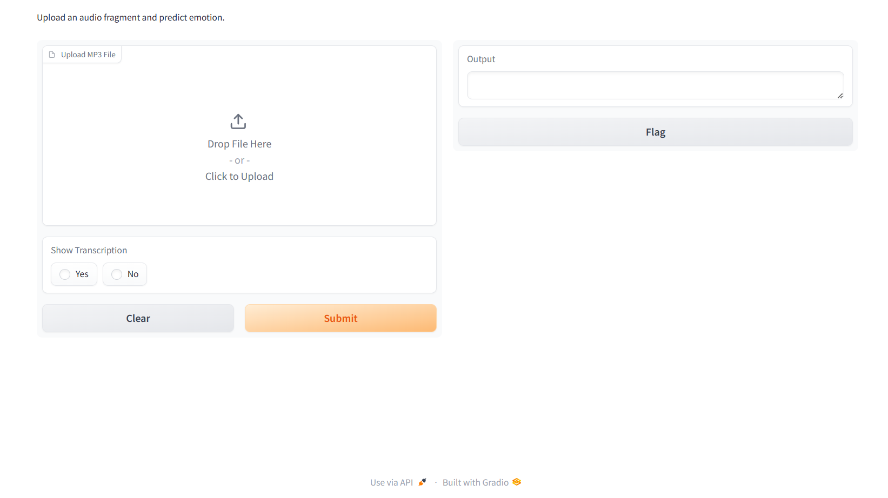

# Content Classification Pipeline for Viewer Emotion Analysis - Banijay Benelux

## Project Overview

In collaboration with Banijay Benelux, we developed a content classification pipeline to analyze viewer emotions in response to specific show segments. Banijay approached us to enhance their ability to assess how different parts of a show impact audience engagement through data-driven insights. Our solution processes show episodes, transcribes audio, and classifies emotions using state-of-the-art natural language processing techniques. This project was part of our university coursework, and we competed in a Kaggle-style challenge, where our pipeline earned second place out of numerous teams.

---


## Team Members

- Lea Banovac
- Michal Dziechciarz
- Stijn Heesters
- Francisco Mansilha
- Rens van den Berg

---

## Pipeline Overview

Our pipeline identifies specific episodes and time-stamped fragments of Banijay’s show based on fragment names, converts these video fragments to audio, transcribes the Dutch audio and translates it to English using Whisper. The transcriptions are processed by a fine-tuned RoBERTa model that classifies the emotions expressed within each fragment. The classified emotions can be compared with viewer ratings to provide Banijay with insights into how emotional content correlates with viewer engagement.

This pipeline is designed for easy interaction through a Gradio interface, enabling non-technical users to run the system effortlessly.

---

## Pipeline Access

Unfortunately, it was not possible to upload the entire pipeline, including the model and audio fragments, due to the size limitations (over 25MB). However, you can access the final version of the pipeline via this link:

> ## [**Final Pipeline**](https://edubuas-my.sharepoint.com/:u:/g/personal/220387_buas_nl/ESjA5NiLqvdMotT430_0fvkB4BVl_60BJN9z4IXMvieU8w?e=s7o9PB)

---


## How to Use the Pipeline

1. **Install Dependencies**: Install the required packages using `requirements.txt`.
2. **Run the Notebook**: Open `Speech-to-text pipeline.ipynb` and execute the code cells.
3. **Interface**: Once running, you’ll find an easy-to-use interface for uploading audio files.



The pipeline expects the audio files to follow a specific naming format, detailed in the notebook. You can find properly formatted audio files in the `fragments_per_episode` folder.

---

## Pipeline Workflow

### 1. **Data Preparation**
   - **Audio Fragments**: In the `fragments_per_episode` folder, you'll find audio fragments for each episode of *Expedite Robinson 22*. Each episode is subdivided into fragments, split according to the `Expiditie_Robinson_data.csv` file.
   - **Human Labels**: The `client_data/Expiditie_Robinson_Data/fragment_emotions.csv` contains human-labeled emotions for each fragment, which the pipeline uses for comparison.

### 2. **Model Loading**
   The pipeline uses the following key files to make predictions:
   - `models/Roberta_V3-final/label_encoder.joblib` – Maps model output to emotion labels.
   - `models/Roberta_V3-final/tokenizer/` – Tokenizes input text for model processing.
   - `models/Roberta_V3-final/model/` – Fine-tuned RoBERTa model for emotion classification.

### 3. **Transcription and Emotion Prediction**
   The pipeline transcribes the uploaded audio files using Whisper, predicts the emotion using RoBERTa, and compares the predictions with the human labels in the dataset.

   ```python
   # Loading the dataframe with the data about fragment and the emotion labels
   df = pd.read_csv(
       'client_data/Expiditie_Robinson_Data/fragment_emotions.csv')

   # Loading the model
   model_path = "models/Roberta_V3-final/model"
   tokenizer_path = "models/Roberta_V3-final/tokenizer"
   label_encoder_path = "models/Roberta_V3-final/label_encoder.joblib"
   ```

   The model classifies emotions into one of six categories:
   - Anger
   - Disgust
   - Fear
   - Happiness
   - Sadness
   - Surprise

   The following function predicts the emotion from the text transcribed:

   ```python
   # Function to predict emotion from text
   def predict_emotion(text, model_path, tokenizer_path, label_encoder_path):

       # Suppress informational messages from Transformers and TensorFlow
       logging.getLogger("transformers").setLevel(logging.ERROR)
       tf.get_logger().setLevel(logging.ERROR)

       # Load the model and tokenizer
       model = TFAutoModelForSequenceClassification.from_pretrained(model_path, from_pt=False)
       tokenizer = AutoTokenizer.from_pretrained(tokenizer_path)

       # Emotion dictionary
       emotion_dict = {
           0: 'anger',
           1: 'disgust',
           2: 'fear',
           3: 'happiness',
           4: 'sadness',
           5: 'surprise'
       }

       # Tokenize the input text and convert to tensors
       inputs = tokenizer(text, return_tensors="tf", padding=True, truncation=True, max_length=512)

       # Predict
       outputs = model(inputs['input_ids'], attention_mask=inputs['attention_mask'])

       # Process the prediction
       predictions = tf.nn.softmax(outputs.logits, axis=-1)
       predicted_label_idx = tf.argmax(predictions, axis=-1).numpy()[0]

       # Map the predicted index to the corresponding emotion
       predicted_emotion = emotion_dict[predicted_label_idx]

       return predicted_emotion
   ```

### 4. **Emotion Prediction in Practice**

The pipeline handles uploaded audio files as follows:
   - Transcribes the audio into text.
   - Predicts the emotional content of the transcription using the function `predict_emotion`.
   - Compares the predicted emotions to the human-labeled data for validation.

   The following function runs the complete process from transcription to emotion comparison:

   ```python
   def transcribe_find_and_predict_emotion(uploaded_file, show_transcription):
       if uploaded_file is None:
           return "No file uploaded. Please upload an MP3 file."

       file_name = uploaded_file.name

       # Use regex to extract episode and fragment numbers
       match = re.search(r'ER22_ep(\d+)_fra_(\d+)\.mp3', file_name)
       if not match:
           return "Invalid file name format. Please ensure the file follows the naming convention: ER22_ep<episode_num>_fra_<fragment_num>.mp3"

       episode, fragment = match.groups()

       episode_num=int(episode)
       fragment_num=int(fragment)

       # Initialize messages list to accumulate output messages
       messages = []

       # Load the Whisper model
       model = whisper.load_model("base")
      
       mask = (df['Episode name'] == episode_num) & (df['Fragment Number'] == fragment_num)
       filtered_df = df[mask]
      
       if not filtered_df.empty:
           audio = model.transcribe(uploaded_file, language="en", fp16=False)
           transcription_text = audio['text']

           if show_transcription == "Yes":
               messages.append(f"\nTranscribed Text:\n{transcription_text}")
          
           messages.append("\nProceeding with emotion prediction")

           # Predict the emotion from the transcription
           predicted_emotion = predict_emotion(transcription_text, model_path, tokenizer_path, label_encoder_path)
           messages.append(f"\nPredicted emotion: {predicted_emotion}")

           # Check if the predicted emotion matches any of the labeled emotions in the row
           emotion_columns = [col for col in df.columns if 'Emotion_' in col]
           row_emotions = filtered_df.iloc[0][emotion_columns].values
           unique_emotions = set(row_emotions) - {'no emotion'}
          
           if predicted_emotion in unique_emotions:
               messages.append(f"\nSuccess! The model correctly predicted that emotion label inside the fragment! \nOther possible label options were: {unique_emotions}")
           else:
               messages.append(f"\nUnfortunately, that was not the labelled prediction... \nThe possible label options were: {unique_emotions}")
       else:
           messages.append("Unfortunately, that fragment does not exist or was not labelled. Please select a different fragment or episode.")

       return "\n".join(messages)
   ```

---

Here’s the revised "Improving the Project" section based on your clarification:

---

## Limitations and Challenges

Due to the nature of our university project, we fine-tuned our models using a dataset we scraped rather than directly using Banijay’s show's transcriptions or human-labeled data. It was unfortunate, as working with the actual show’s labeled data could have yielded more specific insights and a higher accuracy. However, despite this, our pipeline performed admirably, earning second place in the Kaggle competition organized for this project.

---

## Improving the Project

If we had the opportunity to continue working on this project, we would have fine-tuned our model using Banijay's actual show data, which included fragments labeled with emotions by humansas we stated previously. Unfortunately, due to the educational context of the project, we were not allowed to do so, and instead had to fine-tune our model using a dataset we scraped. If you would like to know more details about this please take a look at our Final Presentation and Final report which you can find in the `final_presentations` folder


---


## Acknowledgment

This project was developed by Michal, Lea, Francisco, Stijn, and Rens as part of our university coursework at BUas in collaboration with Banijay Benelux.

